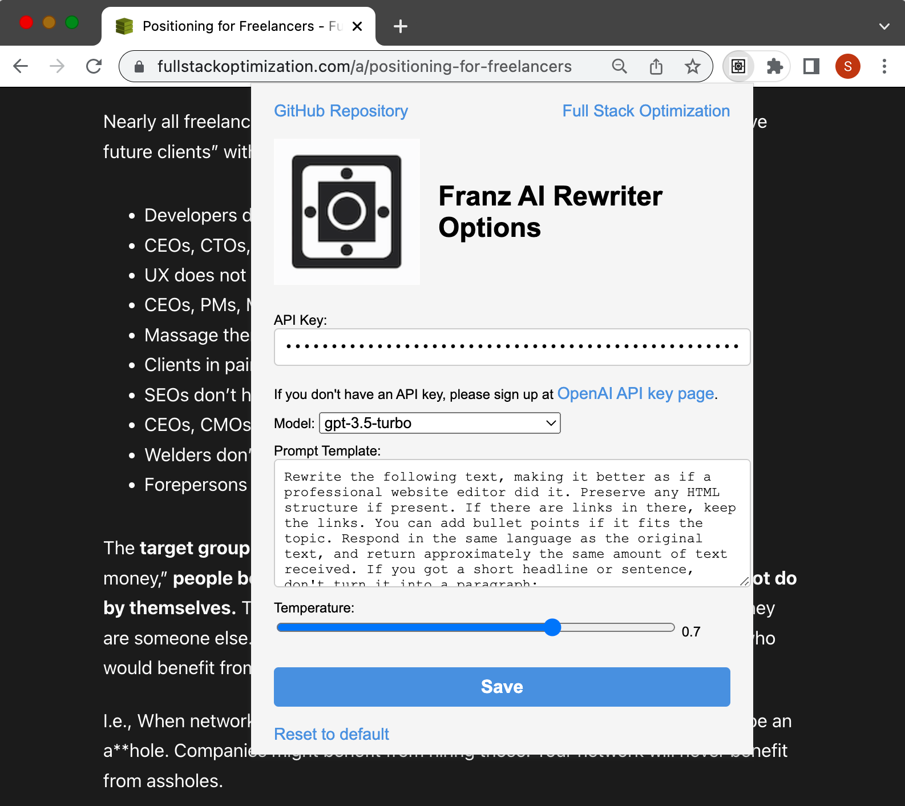
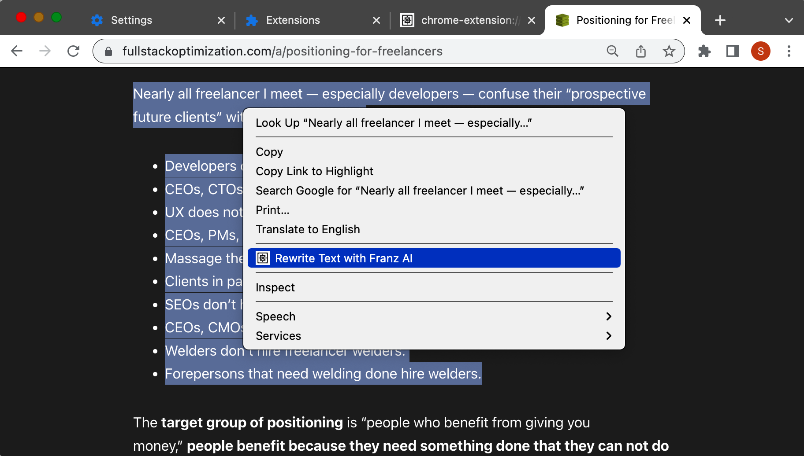

Franz AI Rewriter Chrome Extension
==================================

The Franz AI Rewriter Chrome Extension is a powerful and efficient tool designed for content creators and developers. It enables users to effortlessly rewrite text on any webpage using OpenAI's API, including the advanced GPT-3.5 Turbo and GPT-4 models. **Please note that you need your own OpenAI API key to use this extension.**

INSTALL INSTRUCTIONS:
---------------------

1. Visit <https://github.com/franzenzenhofer/rewriteai> to access the extension's source code.
2. Download the `franz-ai-chrome-extension.zip` file from the repository.
3. Extract the ZIP file to a folder on your computer.
4. Open Chrome and navigate to chrome://extensions.
5. Enable "Developer mode" by toggling the switch in the top-right corner.
6. Click the "Load unpacked" button and select the folder containing the extracted extension files.
7. The extension should now be installed and visible in the extensions list.

SETUP AND USAGE:
----------------

1. Click on the extension icon in the Chrome toolbar and open the Options page.
2. Enter your OpenAI API Key in the "API Key" field. If you don't have an API key, sign up at <https://platform.openai.com/account/api-keys>.
3. Choose the desired model from the "Model" dropdown (default is gpt-3.5-turbo).
4. Customize the "Prompt Template" if needed, or use the provided default.
5. Adjust the "Temperature" slider to control the level of creativity in the rewritten text.
6. Click "Save" to store your settings.
7. To use the extension, simply select the text you want to rewrite, right-click it, and choose "Rewrite Text with Franz AI" from the context menu. The selected text will be rewritten using the OpenAI API.

PRIVACY POLICY AND SECURITY:
----------------------------

This extension uses the OpenAI API to rewrite selected text. The extension sends the selected text to the OpenAI API for processing. The API Key entered in the Options page is used for authentication purposes only and is not shared with any other parties.

Please note that by using this extension, you are agreeing to OpenAI's [Privacy Policy](https://openai.com/policies/privacy-policy) and [Terms of Service](https://platform.openai.com/docs/terms-of-service). It is important to review these documents to understand how OpenAI handles your data.

If you have any questions or concerns about the privacy and security of this extension, please refer to OpenAI's Privacy Policy or reach out to their support team.